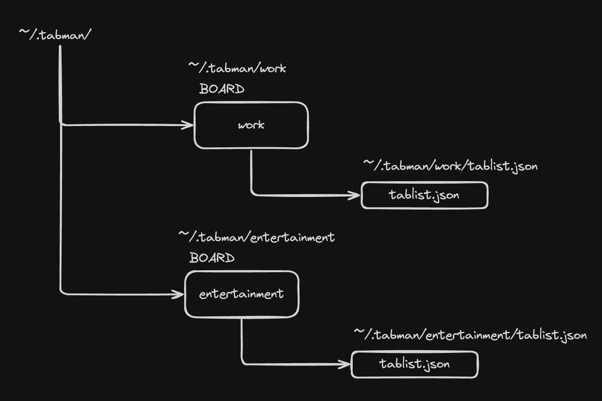

# TabMan CLI

TabMan is a lightweight and powerful CLI tool for managing your Chrome tab details. Export tab information such as Tab ID, name, and URL, and organize them into custom boards for easy access and productivity.

---

## Features

- **Export Tab Details**: Save tab ID, name, and URL to a local directory (`~/.tabman`).
- **Day Management**: Manage tabs for the day or archive them for future reference.
- **Lightweight and Fast**: A simple and efficient CLI solution for tab management.

---

## Installation

### Quick Install(single line)

Run the following command to install TabMan:

```bash
curl -fsSL https://raw.githubusercontent.com/abhishek71994/tab-manager-cli/main/install.sh | bash
```

### Clone and install

### Prerequisites

- **Operating System supported**: macOS
- **Dependencies**:
  - `Go` (v1.21 or higher)

1. Clone the repository:

   ```bash
   git clone https://github.com/abhishek71994/tab-manager-cli.git
   cd tab-manager-cli
   ```

2. Install dependencies:

   ```bash
   go mod init
   ```

3. Use makefile to install:

   ```bash
   make install
   ```

---

## Usage

### Command Reference

**NAME**:  
   tabman - A CLI tool to manage tabs.

**USAGE**:  
   tabman [global options] command [command options]

**COMMANDS**:

- **create-board, cb**:  
  Create a new board. Example:
  ```bash
  tabman create-board <board-name>
  ```

- **list-boards, lb**:  
  List all boards. Example:
  ```bash
  tabman list-boards
  ```

- **delete-board, deb**:  
  Delete a board by name. Example:
  ```bash
  tabman delete-board <board-name>
  ```

- **list-tab, lt**:  
  List tabs inside a board. Example:
  ```bash
  tabman list-tab <board-name>
  ```

- **close-tab, ct**:  
  Close a tab by ID. Example:
  ```bash
  tabman close-tab <tab-id>
  ```

- **list-current-tabs, curt**:  
  List all the current tabs on Chrome. Example:
  ```bash
  tabman list-current-tabs
  ```

- **help, h**:  
  Shows a list of commands or help for one command. Example:
  ```bash
  tabman help
  ```

**GLOBAL OPTIONS**:

- `--help, -h`:  
  Show help.

---

## Configuration

TabMan stores its data in the `~/.tabman` directory by default.



---

## Contributing

We welcome contributions! Follow these steps to get started:

1. Fork the repository.
2. Create a new branch for your feature:

   ```bash
   git checkout -b feature-name
   ```

3. Make your changes and test them locally.
4. Submit a pull request with a detailed description of your changes.

---

## Roadmap

[feature readme file](./arch-resource/feature.md)

---

## License

This project is licensed under the [GNU General Public License v3.0](LICENSE).

---

## Support

If you encounter any issues or have questions, please open an issue on GitHub or contact [abhishek71994@gmail.com].

---

## Acknowledgments

Special thanks to the open-source community for inspiring this project!
